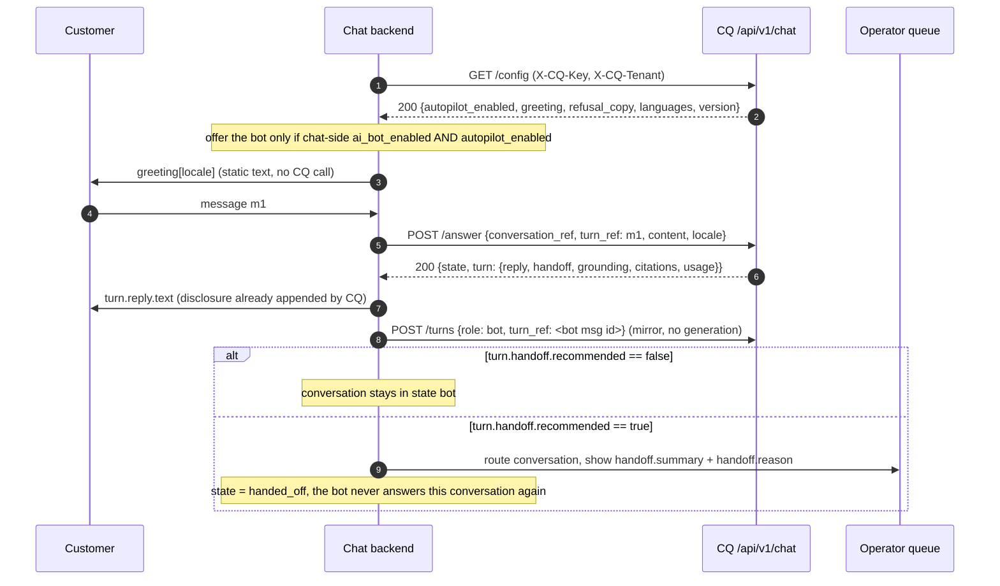
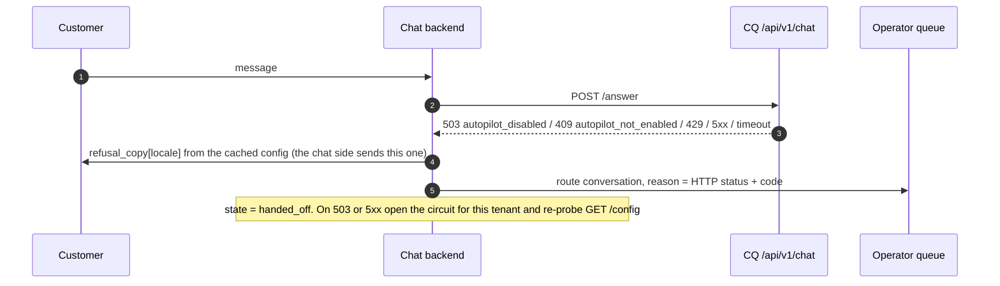
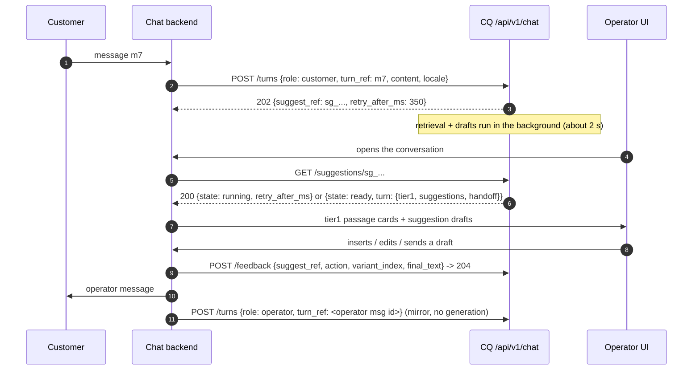

# CQ chat integration — the contract for the chat-service backend

**Audience:** engineers building the chat service's backend integration with CQ.
**Source of truth:** `backend/app/routers/chat.py`, `services/chat.py`, `services/auth.py`,
`services/chat_credentials.py` on `main` as of 2026-09-08. Where `docs/ADR-001` and the code
differ, this document follows the **code** and says so in a one-line *ADR note*.

- **Base URL:** `https://ai.communiq.ge/api` — every path below is relative to it, so
  `POST /v1/chat/answer` is `https://ai.communiq.ge/api/v1/chat/answer`.
- **Transport:** server-to-server HTTP request/response, JSON bodies. Server-Sent Events are
  optional (`?stream=1` on the answer; a ticketed stream for the copilot). **No WebSocket.**
- **Locales:** `ka` | `ru` | `en`. Anything else is treated as `en` by the engine.

---

## 1. What this is

CQ is the AI layer behind the chat product. Per tenant it holds a knowledge base (KB), a chat
config (persona, greeting, refusal copy, languages, AI-disclosure copy, escalation keywords,
rate caps) and the LLM spend. **The chat backend is the system of record for conversations and
messages; CQ keeps a lossy mirror** — enough history to answer and to draft, nothing more.

Over one prefix, `/v1/chat/`, CQ offers three things:

| Layer | Endpoint | What it does |
|---|---|---|
| **Autopilot (the bot)** | `POST /v1/chat/answer` | Given the customer's message, returns a reply that is either grounded in the tenant's *published* KB documents, or the tenant's refusal copy — and, in either case, a `handoff` block saying whether a human should take over. No general knowledge unless the tenant opted in. **CQ appends the AI-disclosure line itself; do not add another.** |
| **Copilot (drafts for an operator)** | `POST /v1/chat/turns` → `GET /v1/chat/suggestions/{suggest_ref}` | Every customer message is ingested (202, ~15 ms); drafts are generated in the background and read back with one indexed SELECT — or streamed over SSE. `POST /v1/chat/feedback` records what the operator did with a draft. |
| **Mirror** | `POST /v1/chat/conversations:sync`, `DELETE /v1/chat/conversations/{external_ref}` | Bulk-mirror threads CQ never served; purge one thread on GDPR erasure. |

**The bot is the first layer.** On each new customer message in a conversation that is still in
bot mode — for a tenant whose bot is enabled on **both** sides (§4) — the chat backend calls
`POST /v1/chat/answer` and sends `turn.reply.text` to the customer. When
`turn.handoff.recommended` is `true`, **or** the call fails with **503** (kill switch), **409**
`autopilot_not_enabled`, **429**, or any **5xx**, the conversation is routed to a human operator,
the operator is shown `handoff.summary` / `handoff.reason`, and **the bot stops answering that
conversation for good**. From then on the chat backend keeps calling `POST /v1/chat/turns` for
every message so the operator gets copilot drafts.

---

## 2. Flows

### 2.1 Bot-first (autopilot)



### 2.2 Handoff on an HTTP failure



### 2.3 Copilot after handoff



---

## 3. Credentials & headers

### The credential

One credential for the whole chat service, **issued once by the CQ superadmin** from the admin
console (Bot → Integration credentials; `POST /admin/integrations`) and **shown exactly once** —
CQ stores only `sha256(secret)`, so a lost key is rotated, not recovered. Format:

```
cqi_<key_id>.<secret>
```

- `key_id` is a public lookup handle; `secret` is 256 bits of CSPRNG.
- **Scopes** are fixed at issuance from `chat:turn`, `chat:suggest`, `chat:answer`, `chat:sync`.
  Ask for **all four**. `kb:write`, `kb:delete`, `scoring:write` and `admin:*` can never be
  issued to an integration, so this key can never write to a KB.
- **Tenants are granted to the credential one at a time** (superadmin, `POST
  /admin/integrations/{id}/grants`). An ungranted tenant selector is a **401**, indistinguishable
  from a wrong key. Deactivating a tenant in CQ also 401s that tenant.
- **Rotation** is dual-key: `POST /admin/integrations/{id}/rotate` mints a second secret and puts an
  `expires_at` (default **7 days**) on the current one; both verify during the overlap. Deactivating
  the integration revokes every secret at once.

### Headers

| Header | Required on | Value | Behaviour |
|---|---|---|---|
| `X-CQ-Key` | every call except `GET /v1/chat/stream` and `GET /v1/chat/health` | `cqi_<key_id>.<secret>` | Must be the **only** credential header. Sending it together with `Authorization`, `X-API-Key` or `X-Admin-Token` is a **400** `Present exactly one credential; got …`. |
| `X-CQ-Tenant` | with `X-CQ-Key` | CQ `client_id` (uuid, **recommended**) or the tenant `slug` | A *selector* that narrows within the credential's grants — never trusted as identity. Missing, unknown, ungranted or inactive → **401** `Invalid integration credential or tenant selector.` |
| `X-CQ-Expect-Tenant` | every write: `POST /turns`, `/answer`, `/regenerate`, `/feedback`, `/conversations:sync`, `DELETE /conversations/…` | the same `client_id` (uuid, or the slug you selected with) | An *assertion*: CQ compares it with the tenant the grant lookup resolved. Missing → **400** `X-CQ-Expect-Tenant is required on write requests.`; mismatch → **403** `Tenant expectation mismatch.` Ignored on reads — send it on every call anyway. |
| `X-CQ-End-User` | recommended on `/turns` and `/answer` | an **opaque, stable** end-user id | Per-end-user rate cap (§7). Overrides body `customer_ref`. Hashed in the counters, but stored as-is on the conversation row, so **send an opaque id, never an email or phone number**. Never authorization. |
| `Idempotency-Key` | optional on `/turns` and `/answer` | a uuid per logical message | Second replay key (§8). If `turn_ref` is absent it also becomes the `turn_ref`. |
| `Content-Type` | JSON bodies | `application/json` | |

Every response echoes the **resolved** `client_id`. Assert it equals the `cq_client_id` you sent;
a difference is a mapping bug on your side (and, with `X-CQ-Expect-Tenant` set, cannot happen
without a 403 first).

### curl

```bash
BASE=https://ai.communiq.ge/api
KEY='cqi_<key_id>.<secret>'          # server secret — never in a browser, never in a URL
TENANT='<cq_client_id uuid>'

# transport probe (unauthenticated) — proves the proxy streams
curl -s $BASE/v1/chat/health

# tenant config: the CQ-side enable flag, the greeting, the refusal copy
curl -s $BASE/v1/chat/config -H "X-CQ-Key: $KEY" -H "X-CQ-Tenant: $TENANT"

# the bot answers one customer message (blocking)
curl -s -X POST $BASE/v1/chat/answer \
  -H "X-CQ-Key: $KEY" -H "X-CQ-Tenant: $TENANT" -H "X-CQ-Expect-Tenant: $TENANT" \
  -H "X-CQ-End-User: cust_91" -H "Content-Type: application/json" \
  -d '{"conversation_ref":"conv_8813","turn_ref":"msg_551","content":"რა ღირს გადარიცხვა?","locale":"ka","channel":"web"}'

# the same, streamed
curl -sN -X POST "$BASE/v1/chat/answer?stream=1" \
  -H "X-CQ-Key: $KEY" -H "X-CQ-Tenant: $TENANT" -H "X-CQ-Expect-Tenant: $TENANT" \
  -H "Content-Type: application/json" \
  -d '{"conversation_ref":"conv_8813","turn_ref":"msg_552","content":"…","locale":"ka"}'

# copilot ingest (after handoff), then the warm read
curl -s -X POST $BASE/v1/chat/turns \
  -H "X-CQ-Key: $KEY" -H "X-CQ-Tenant: $TENANT" -H "X-CQ-Expect-Tenant: $TENANT" \
  -H "X-CQ-End-User: cust_91" -H "Content-Type: application/json" \
  -d '{"conversation_ref":"conv_8813","turn_ref":"msg_560","content":"…","role":"customer","locale":"ka"}'
curl -s $BASE/v1/chat/suggestions/sg_<turn_id> -H "X-CQ-Key: $KEY" -H "X-CQ-Tenant: $TENANT"
```

---

## 4. Tenant mapping and the two-sided enable check

**Per chat tenant, store two things:** `cq_client_id` (CQ's tenant uuid, given to you by the CQ
operator when the grant is created) and `ai_bot_enabled` (your own flag, behind an admin toggle).
Send `cq_client_id` as **both** `X-CQ-Tenant` and `X-CQ-Expect-Tenant`. A tenant without a
`cq_client_id` must not produce any CQ call.

**CQ's side of the switch** is `GET /v1/chat/config → autopilot_enabled`. It is `false` until a
human turned it on in the CQ console, and CQ refuses to turn it on while the tenant has no
*published* KB document. **Offer the bot to a new conversation only when both flags are true.**
Cache the config per tenant (60 s is fine; `version` increments on every save) and invalidate it
whenever an `/answer` returns **409** `autopilot_not_enabled` or **503** `autopilot_disabled`.

Being in bot mode is a **per-conversation** decision made once, at the first customer message;
a conversation that has been handed off never returns to the bot, even if both flags are true.

**Greeting:** render `greeting[locale]` from the config as the bot's first message — a static
string, no model call. Fallback order: `greeting[locale]` → `greeting["en"]` →
`greeting[languages[0]]` → send no bot greeting. `greeting` may be `{}` for a tenant that never
configured one. **Do not mirror the greeting into CQ** as a `bot` turn: the disclosure-`first`
mode (§6) treats any prior bot turn as "already disclosed", and a mirrored greeting would
suppress the disclosure on the bot's first real answer.

---

## 5. Endpoints, in flow order

All request bodies are JSON. All error bodies are `{"detail": "<string>"}`; the chat router's own
errors add a **sibling** `"code"` (never nested in `detail`). Errors raised by the shared auth and
rate-limit layers (400/401/403/429 in §7) carry **no** `code`. Pydantic validation errors are
FastAPI's default **422** with a *list*-shaped `detail`.

### 5.0 `GET /v1/chat/health` — transport probe

Unauthenticated. `{"status":"ok","transport":"chat"}`. Use it from the chat backend's host to
prove the path through the proxy before anything else.

### 5.1 `GET /v1/chat/config` — any chat scope

```json
{
  "client_id": "6f1c0d8e-…",
  "version": 3,
  "persona": "…",
  "greeting":      {"ka": "გამარჯობა! …", "ru": "Здравствуйте! …", "en": "Hello! …"},
  "refusal_copy":  {"ka": "…", "ru": "…", "en": "…"},
  "languages": ["ka", "ru", "en"],
  "canned": [],
  "autopilot_enabled": true,
  "scopes": ["chat:turn", "chat:suggest", "chat:answer", "chat:sync"]
}
```

- `version: 0` with empty `greeting`/`refusal_copy` means the tenant runs on built-in defaults.
- `refusal_copy[locale]` is the exact text CQ puts in `reply.text` when it refuses; use it as your
  own fallback message when an `/answer` call fails (§2.2). If empty, CQ's built-in refusal is:
  *EN* "I don't have that in my knowledge base, so I don't want to guess. Let me pass you to a
  colleague who can help." (KA and RU equivalents exist.)
- `languages[0]` is the locale CQ assumes when you omit `locale`.

### 5.2 `POST /v1/chat/answer` — scope `chat:answer` — the bot

Blocking by default; `?stream=1` returns SSE (§5.2.2).

**Request**

```json
{
  "conversation_ref": "conv_8813",
  "turn_ref": "msg_551",
  "content": "რა ღირს გადარიცხვა სხვა ბანკში?",
  "channel": "web",
  "locale": "ka",
  "customer_ref": "cust_91",
  "display_name": "Nino",
  "subject": null,
  "attachment": null
}
```

| Field | Rules |
|---|---|
| `conversation_ref` | **required**, 1–200 chars. Your thread id. Unique per tenant on your side. |
| `content` | **required**. Trimmed; empty → **400** `empty_content`; > **8000** chars → **413** `content_too_large`. |
| `turn_ref` | ≤ 200 chars. **Your message id** — the idempotency key (§8). Strongly recommended. |
| `channel` | opaque string, default `"web"` (`whatsapp`, `messenger`, … are fine). Used for per-channel disclosure copy. |
| `locale` | `ka` \| `ru` \| `en`. Default: the tenant's `languages[0]`. |
| `customer_ref` | opaque end-user id; the `X-CQ-End-User` header wins when both are present. |
| `display_name`, `subject`, `attachment` | ≤ 200 chars each. Optional context from social channels; CQ quarantines them as untrusted input. Do **not** concatenate them into `content`. |

There is no `role` (an answer is always a reply to the **customer**) and no `mode`.

**Order of checks** (why the status codes come in this order): kill switch (**503**) → tenant
`autopilot_enabled` (**409**) → content (**400/413**) → mirror write → rate caps (**429**, only for
a message CQ has not seen before) → replay check (§8) → the engine.

**Blocking response — 200**

```json
{
  "client_id": "6f1c0d8e-…",
  "conversation_id": "9a2b…",
  "conversation_ref": "conv_8813",
  "turn_id": "c0de…",
  "turn_ref": "msg_551",
  "suggest_ref": "an_c0de…",
  "state": "ready",
  "idempotent_replay": false,
  "turn": {
    "proto": 1,
    "turn_ref": "msg_551",
    "suggest_ref": "an_c0de…",
    "conversation_ref": "conv_8813",
    "client_id": "6f1c0d8e-…",
    "channel": "web",
    "locale": "ka",
    "grounding": {"grounded": true, "reason": "ok", "method": "vector",
                  "top_score": 0.71, "hit_count": 4, "kb_present": true},
    "citations": [{"n": 1, "document_id": "…", "chunk_id": "…", "title": "გადარიცხვების ტარიფები", "score": 0.71}],
    "tier1": [],
    "suggestions": [],
    "reply": {"text": "სხვა ბანკში გადარიცხვა ღირს … [1]\n\n(ავტომატური ასისტენტი — ნებისმიერ დროს შეგიძლიათ კოლეგას დაუკავშირდეთ.)",
              "citations": [{"n": 1, "document_id": "…", "chunk_id": "…", "title": "…", "score": 0.71}],
              "answered_from_kb": true},
    "handoff": {"recommended": false, "reason": null, "summary": null},
    "usage": {"input_tokens": null, "output_tokens": null, "model": "claude-…",
              "latency_ms": {"kill_switch": 1, "retrieval": 180, "gate": 0, "llm": 2400, "validate": 1, "total": 2600}}
  }
}
```

- `state` is `"ready"` when `turn.grounding.grounded` is true and `"refused"` otherwise. **Make the
  routing decision on `turn.handoff.recommended`, not on `state`** — an opted-in general-knowledge
  answer is `refused` + handoff, an escalation is `refused` + handoff, and a grounded answer that
  promises money is `ready` + handoff.
- `turn.reply.text` is **never empty** on a 200: it is the answer or the tenant's refusal copy, with
  the disclosure line appended by CQ. Live `[n]` markers stay in the text and index `citations`;
  strip them for channels where they look odd, or render them as footnotes.
- `suggest_ref` is `an_<turn_id>` for answers. Persist it — it is the join key for everything.

**Engine outcomes, all HTTP 200** (see §6 for the reason strings):

| Situation | `grounding.reason` | `reply.text` | `handoff` |
|---|---|---|---|
| Customer asks for a human / legal threat / distress / tenant escalation keyword | `escalation` | refusal copy | `recommended: true`, `reason: "escalation:<marker>"`, model-written `summary` (+ `goal`) |
| KB has no usable answer (tenant KB empty, no hits, score below 0.45, keyword-only match) | `kb_empty` \| `no_hits` \| `low_score` \| `keyword_only` | refusal copy | `true`, `reason` = that string, `summary` = last customer message (≤ 400 chars). **Zero tokens spent.** |
| Grounded answer | `ok` | the answer (≤ 1200 chars by default) | `recommended: false` — **unless** the text is commitment-shaped (price, discount, refund promise): then `true`, `reason: "commitment:<label>"` |
| Tenant opted into general knowledge and the KB had nothing | `no_hits` etc. with `grounded: false` | the answer | `true`, `reason: "ungrounded_answer"` |
| Model call failed mid-answer | `llm_error` | refusal copy | `true`, `reason: "llm_error"` |

#### 5.2.1 Failure responses specific to this endpoint

| Status | `code` | Meaning |
|---|---|---|
| 503 | `autopilot_disabled` | The **operator kill switch** (global or for this tenant). Takes effect within 5 s of being flipped. |
| 409 | `autopilot_not_enabled` | The tenant's CQ-side flag is off. |
| 409 | `answer_in_flight` | A concurrent delivery of the **same `turn_ref`** is still being answered. |
| 502 | `generation_failed` | Replay of a `turn_ref` whose first attempt failed. Permanent for that `turn_ref`. |
| 502 | `answer_failed` | This attempt failed. The same `turn_ref` will now replay as `generation_failed`. |
| 429 | `llm_busy` | CQ's model admission control refused the call. |
| 429 | *(none)* | Rate cap: `Rate limit reached for chat_answer (60 per minute).` or `(60 per hour)`. |

#### 5.2.2 `?stream=1` — SSE

Same body, same headers, same pre-checks (a 503/409/400/413/429 arrives as a normal JSON error
**before** any stream starts). On success the response is `text/event-stream`. Frames are
`event: <name>` + `data: <json>`; every payload carries `seq`; a `: ping` comment line arrives
every **15 s**; there is **no** `id:` and **no resume protocol**.

```
event: open
data: {"client_id":"6f1c…","suggest_ref":"an_c0de…","state":"running","seq":0}

event: grounding
data: {"grounded":true,"reason":"ok","method":"vector","top_score":0.71,"hit_count":4,"kb_present":true,"seq":1}

event: delta
data: {"text":"სხვა ბანკში ","seq":2}

event: delta
data: {"text":"გადარიცხვა ღირს","seq":3}

event: done
data: {"turn":{ …the full Turn envelope, byte-identical to the blocking body's "turn"… },"seq":9}
```

Sequences you will see on the answer stream:

| Path | Frames |
|---|---|
| grounded answer | `open` → `grounding` → `delta`* → `done` |
| gate refusal (`no_hits` …) | `open` → `grounding` → `done` |
| escalation, or kill/disable caught inside the engine | `open` → `done` |
| model failure mid-stream | `open` → `grounding` → `delta`* → `error {"code":"llm_busy"\|"llm_error","message":…,"fatal":false}` → `done` (refusal + handoff) |
| replay of a finished answer | `open {"state":"ready"\|"refused"}` → `grounding` → `tier1 {"cards":[]}` → `done` — ignore `tier1` on the answer path |
| CQ-side stream failure | `error {"detail":…,"code":"stream_failed"\|"not_found"\|"timeout"\|"generation_failed"}` and the stream ends |

Rule of thumb: an `error` frame that carries `"fatal": false` is followed by a `done`; one that
carries `detail` is terminal. Reconnecting after a drop = re-POST with the same `turn_ref` (§8).

### 5.3 `POST /v1/chat/turns` — scope `chat:turn` — **202** — the copilot ingest

Call it for **every** message once a conversation is handed off — customer messages *and*
operator messages — and, in bot mode, for each bot reply you sent (see *What to mirror* below).

**Request**

```json
{
  "conversation_ref": "conv_8813",
  "turn_ref": "msg_560",
  "content": "…",
  "role": "customer",
  "channel": "web",
  "locale": "ka",
  "customer_ref": "cust_91",
  "mode": "assist",
  "precompute": true
}
```

| Field | Rules |
|---|---|
| `role` | `customer` \| `operator` \| `bot`. **Only `customer` produces a suggestion**; the other two are mirrored for history. (CQ stores the string as-is — send exactly these values.) |
| `mode` | must be `"assist"` (default). Anything else — including `"autopilot"` — is a **422**: the bot is `POST /answer`, never this route. |
| `precompute` | `true` (default): generation starts in the background and `GET /suggestions` will find it. `false`: nothing runs until *you* open the ticket stream (§5.5) — only for a UI that streams every draft. |
| the rest | as for `/answer`; `content` limits identical (400 / 413). |

**Response — 202**

```json
{
  "client_id": "6f1c0d8e-…",
  "conversation_id": "9a2b…",
  "conversation_ref": "conv_8813",
  "turn_id": "d1a7…",
  "turn_ref": "msg_560",
  "suggest_ref": "sg_d1a7…",
  "precompute": true,
  "idempotent_replay": false,
  "retry_after_ms": 350
}
```

`suggest_ref` is `null` and `retry_after_ms` is `0` for `operator`/`bot` roles and for replays
that started nothing. Operator/bot mirrors are metered as copilot turns (§7) but never call a model.

**What to mirror, and why.** CQ's history window for both engines is the **last 8 mirrored turns**
of the conversation — nothing else. CQ does **not** add its own bot replies to that history. So:
mirror **operator** messages (`role: "operator"`) so drafts know what the operator already said,
and in bot mode mirror **each bot reply you sent** (`role: "bot"`, `turn_ref` = that message's id)
so follow-up questions ("and how much is it?") keep their referent and the disclosure-`first`
mode fires once instead of on every reply. Do not mirror the greeting (§4).

### 5.4 `GET /v1/chat/suggestions/{suggest_ref}` — scope `chat:suggest` — the warm read

One indexed SELECT, no model, no retrieval. Poll at `retry_after_ms` (350 ms); a draft is
typically ready ~2 s after the 202. Give up after ~20 s and show the conversation without drafts —
a generation that dies is marked `error` by a reaper after 120 s.

```json
{"client_id":"…","suggest_ref":"sg_d1a7…","state":"running","retry_after_ms":350}
```
```json
{"client_id":"…","suggest_ref":"sg_d1a7…","state":"error","detail":"…","code":"generation_failed"}
```
```json
{
  "client_id": "…", "suggest_ref": "sg_d1a7…", "state": "ready",
  "turn": {
    "proto": 1, "turn_ref": null, "suggest_ref": "sg_d1a7…", "conversation_ref": "9a2b…",
    "client_id": "…", "channel": "web", "locale": "ka",
    "grounding": {"grounded": true, "reason": "ok", "method": "vector", "top_score": 0.63, "hit_count": 5, "kb_present": true},
    "citations": [{"n": 1, "document_id": "…", "chunk_id": "…", "title": "…", "score": 0.63}, {"n": 2, "…": "…"}],
    "tier1": [{"n": 1, "title": "გადარიცხვების ტარიფები", "snippet": "…", "chunk_id": "…", "document_id": "…", "score": 0.63}],
    "suggestions": [
      {"index": 0, "kind": "answer",  "text": "…", "citations": [1, 2]},
      {"index": 1, "kind": "clarify", "text": "…", "citations": []}
    ],
    "reply": null,
    "handoff": {"recommended": false, "reason": null, "summary": null},
    "usage": {"input_tokens": null, "output_tokens": null, "model": "claude-…", "latency_ms": {"retrieval": 170, "gate": 0, "llm": 1900, "total": 2100}}
  }
}
```

- `state` is `ready` or `refused`; **`refused` is a success**: the KB had nothing usable, so
  `suggestions` holds one `kind: "escalate"` card carrying the refusal copy (sendable in one click)
  and `handoff.recommended` is `true`. `tier1` (≤ 3 passage cards) is still present.
- On a copilot envelope `turn_ref` is `null` and `conversation_ref` is **CQ's own
  `conversation_id`**, not your ref — join on `suggest_ref`, which you got from the 202.
- Copilot `suggestions[].citations` are **integers** (`n` into `citations`); autopilot
  `reply.citations` are citation **objects**. *ADR note: the ADR sketch shows integers for both.*
- **404** `not_found`: unknown `suggest_ref` for this tenant (or reaped) — show no draft.

### 5.5 `POST /v1/chat/stream-tickets` + `GET /v1/chat/stream?ticket=…` — copilot SSE

Only needed if the operator UI streams drafts. `EventSource` cannot send headers, so the chat
backend mints a ticket server-side and hands **only the ticket** to the browser:

```json
POST /v1/chat/stream-tickets   {"suggest_ref": "sg_d1a7…"}          (scope chat:suggest)
→ {"client_id":"…","suggest_ref":"sg_d1a7…","ticket":"…","expires_in":60,"url":"/api/v1/chat/stream?ticket=…"}
```

`url` is **origin-relative** (`https://ai.communiq.ge` + `url`), not relative to the base URL.
Tickets live **60 s**, are **single-use**, and are scoped to one `suggest_ref` and one tenant.
`GET /stream` takes **no** `X-CQ-Key`; **401** `bad_ticket` covers invalid / expired / already used;
**404** `not_found` if the suggestion is unknown.

Frames: `open` → `grounding` → `tier1 {"cards":[…]}` → (`error {…,"fatal":false}`) →
`suggestion {index,kind,text,citations,seq}`* → `done {"turn":…}`. **The copilot never emits
`delta`** — its model call is not token-streamed. *ADR note: the ADR lists `delta` on this stream.*
If the generation is already running in the background (the normal `precompute: true` case) the
stream **attaches** and emits `open` and then only the terminal frames once the row finishes
(polling every 250 ms, **90 s** deadline → `error {"code":"timeout"}`). A finished row replays its
terminal frames immediately.

### 5.6 `POST /v1/chat/regenerate` — scope `chat:suggest` — **202**

```json
{"suggest_ref": "sg_d1a7…", "transform": "shorter"}       // transform: shorter | warmer | formal | to_ru | to_ka | null
→ {"client_id":"…","suggest_ref":"rg_…","source_suggest_ref":"sg_d1a7…","transform":"shorter","precompute":true,"retry_after_ms":350}
```

Returns a **new** `suggest_ref` (`rg_…`); the original stays readable. Metered as a copilot turn.
**404** `not_found`; **409** `no_conversation`.

### 5.7 `POST /v1/chat/feedback` — scope `chat:suggest` — **204**

```json
{"suggest_ref": "sg_d1a7…", "action": "edited_sent", "variant_index": 0, "final_text": "…"}
```

`action`: `shown` | `inserted` | `edited_sent` | `sent_asis` | `ignored` (stored as-is — send
exactly these). Send `final_text` on `edited_sent` / `sent_asis`: the edit distance between the
draft and what the operator actually sent is CQ's quality signal. Always **204**, even for an
unknown `suggest_ref` — fire and forget from the composer.

### 5.8 `POST /v1/chat/conversations:sync` — scope `chat:sync`

Bulk-mirror threads CQ never served (operator-only threads, historical DMs). Every conversation
carries its own `client_id`, and **the whole batch is rejected before any write** if any of them
is not the resolved tenant.

```json
{
  "conversations": [{
    "client_id": "6f1c0d8e-…",
    "external_ref": "conv_77",
    "channel": "web",
    "locale": "ka",
    "customer_ref": "cust_5",
    "turns": [
      {"role": "customer", "content": "…", "turn_ref": "msg_1", "lang": "ka"},
      {"role": "operator", "content": "…", "turn_ref": "msg_2"}
    ]
  }]
}
→ {"client_id":"6f1c0d8e-…","conversations":1,"turns":2,"replays":0}
```

- ≤ **100** conversations per batch (**413** `batch_too_large`), ≤ **200** turns each (**413**
  `conversation_too_large`); `content` is silently truncated to 8000 chars.
- A conversation whose `client_id` is another tenant → **403**; an empty `client_id` → **400**
  (with the `X-CQ-Expect-Tenant is required…` message — same check).
- Idempotent per `(tenant, turn_ref)`; `replays` counts turns CQ already had. Always send
  `turn_ref`s, otherwise every re-sync duplicates the thread.

### 5.9 `DELETE /v1/chat/conversations/{external_ref}` — scope `chat:sync` — **204**

GDPR purge of CQ's mirror of one thread (turns, suggestions and feedback cascade). URL-encode
`external_ref`. **Idempotent and always 204**, even when nothing existed — a retried erasure must
not fail. *ADR note: the "pending proposals become superseded" behaviour belongs to the curation
phase, which is not built.*

---

## 6. The Turn envelope — field reference

One object, produced by one function, carried byte-identically by the blocking `turn`, the SSE
`done.turn` and `GET /suggestions … turn`.

| Field | Type | Meaning |
|---|---|---|
| `proto` | `1` | Envelope version. |
| `turn_ref` | string \| null | Your message id, echoed. **null on copilot envelopes.** |
| `suggest_ref` | string | `an_<turn_id>` (answer), `sg_<turn_id>` (copilot), `rg_<hex>` (regenerate). The join key. |
| `conversation_ref` | string | Your `conversation_ref` on answers; **CQ's `conversation_id` on copilot envelopes.** |
| `client_id` | uuid | The tenant CQ resolved. Assert it. |
| `channel` | string | Echo of the request's `channel`. |
| `locale` | `ka`\|`ru`\|`en` | Normalized; unknown input becomes `en`. |
| `grounding.grounded` | bool | Whether CQ was allowed to answer from the KB. |
| `grounding.reason` | string | `ok` · `kb_empty` · `no_hits` · `low_score` · `keyword_only` · `escalation` · `autopilot_off` · `autopilot_killed` · `llm_error`. *ADR note: not in the ADR sketch.* |
| `grounding.method` | `vector`\|`keyword`\|`none` | Retrieval path. The bot only trusts `vector`. |
| `grounding.top_score` | number \| null | Best cosine score (gate threshold 0.45 by default). |
| `grounding.hit_count` | int | Retrieved passages. |
| `grounding.kb_present` | bool | Whether the tenant has any KB the engine could see (published docs only, for the bot). |
| `citations[]` | `{n, document_id, chunk_id, title, score}` | Every retrieved passage, numbered; `[n]` markers in text point here. |
| `tier1[]` | `{n, title, snippet, chunk_id, document_id, score}` | ≤ 3 passage cards for the operator. **Always `[]` on answers.** |
| `suggestions[]` | `{index, kind: answer\|clarify\|escalate, text, citations: [n…]}` | Copilot drafts (default 2; one `escalate` card on refusal). **Always `[]` on answers.** |
| `reply` | `{text, citations: [citation…], answered_from_kb}` \| null | The bot's reply. **null on copilot envelopes.** `text` includes the disclosure line when CQ's disclosure policy says so. |
| `handoff.recommended` | bool | **The routing signal.** |
| `handoff.reason` | string \| null | A gate reason, `escalation:<keyword\|legal_threat\|complaint\|distress>`, `commitment:<label>`, `ungrounded_answer`, `llm_error`; copilot: `commitment_or_model_flagged`. |
| `handoff.summary` | string \| null | What to show the operator: a model-written summary (≤ 600 chars) on escalation/commitment handoffs, otherwise the last customer message (≤ 400 chars). |
| `handoff.goal` | string | Present only when a model summary ran: the customer's goal in ≤ 120 chars. |
| `usage.input_tokens`, `usage.output_tokens` | null | **Always null**: CQ writes tokens to its own `llm_usage` ledger per tenant. *ADR note: the sketch shows numbers.* |
| `usage.model` | string | The model id used. |
| `usage.latency_ms` | object | Per-stage ms: `kill_switch`, `retrieval`, `gate`, `llm`, `validate`, `handoff_summary`, `total` (only the stages that ran). |

**Disclosure.** `reply.text` carries the tenant's AI-disclosure line appended **by CQ** — per tenant
and per channel, default mode `first` (only on the bot's first reply in a thread, judged by the
mirrored history; see §5.3), or `always` / `off` as the tenant configured. **Never add your own.**

---

## 7. Status codes — what the chat backend must do

| Status | `code` (if any) | Where | What it means | What to do |
|---|---|---|---|---|
| 200 | | answer, config, suggestions, tickets, sync | success | answer: send `reply.text`; route on `handoff.recommended`. |
| 202 | | turns, regenerate | accepted, generating | store `suggest_ref`; poll `GET /suggestions` at `retry_after_ms`. |
| 204 | | feedback, DELETE | done | nothing. |
| 400 | `empty_content` | turns, answer | blank message | don't send blanks to CQ. |
| 400 | *(none)* `Present exactly one credential…` | all | two credential headers | **bug** — fix the client; alert. |
| 400 | *(none)* `X-CQ-Expect-Tenant is required…` | writes, sync | header missing / empty `client_id` in a sync item | **bug** — alert; do not retry. |
| 400 | *(none)* `Invalid identifier or value` | any | a malformed uuid somewhere | **bug** — alert. |
| 401 | *(none)* `Invalid integration credential or tenant selector.` | all | wrong/rotated/revoked key, **or** tenant not granted / inactive, **or** `X-CQ-Tenant` missing | **do not retry**; open the circuit for this tenant; alert (rotation overlap expired? grant missing?). In bot mode → operator. |
| 401 | *(none)* `A scoped CQ integration key is required.` | all | missing scope, or a non-integration credential | **bug/config** — alert. |
| 401 | `bad_ticket` | stream | ticket invalid/expired/used | mint a new ticket. |
| 403 | *(none)* `Tenant expectation mismatch.` | writes | your `X-CQ-Expect-Tenant` ≠ the tenant the key resolved | **mapping bug** — alert loudly; do not retry; in bot mode → operator. |
| 404 | `not_found` | suggestions, regenerate, stream | unknown `suggest_ref` | show no draft. |
| 409 | `autopilot_not_enabled` | answer | CQ-side bot flag is off | → operator; invalidate the config cache; stop offering the bot for this tenant until `autopilot_enabled` is true again. |
| 409 | `answer_in_flight` | answer | same `turn_ref` already being answered (duplicate delivery) | **do not** hand off; retry the identical request after 0.5 s, 1 s, 2 s … (≤ 90 s total), then treat as 5xx. |
| 409 | `no_conversation` | regenerate | orphan suggestion | don't retry. |
| 413 | `content_too_large` | turns, answer | > 8000 chars | bot mode → operator (a paste that long is not a question); copilot: mirror a truncated copy. |
| 413 | `batch_too_large` / `conversation_too_large` | sync | > 100 conversations / > 200 turns | split the batch. |
| 422 | *(FastAPI list `detail`)* | any | body validation (e.g. `mode` ≠ `assist`, missing `conversation_ref`, `stream` not 0/1) | **bug** — alert; do not retry. |
| 429 | *(none)* `Rate limit reached for chat_answer (60 per minute).` | answer | tenant cap **60 answers/min**, or **60/hour per `X-CQ-End-User`** | → operator for this conversation; do not retry the same message; back off the tenant for the rest of the window. |
| 429 | *(none)* `… for chat_turns (120 per minute).` | turns, regenerate | copilot caps **120/min per tenant**, **120/hour per end user** | back off; retry the mirror later (idempotent). |
| 429 | `llm_busy` | answer | model admission control | → operator. |
| 502 | `answer_failed` / `generation_failed` | answer | generation failed / a failed `turn_ref` replayed | → operator. **Never loop on the same `turn_ref`.** |
| 503 | `autopilot_disabled` | answer | **kill switch** | → operator; open the tenant's circuit; re-probe `GET /config` every 30–60 s; resume the bot for **new** conversations only when `/answer` succeeds again. |
| any 5xx / timeout / connection error | | any | | bot mode → operator (after one safe retry, §8); copilot → retry the mirror later. |

All caps are per tenant and adjustable by the CQ operator in the tenant's chat config (`limits`:
`answer_tenant_per_minute`, `answer_enduser_per_hour`, `tenant_per_minute`, `enduser_per_hour`).
*ADR note: the ADR lists a tenant/day dimension; the code has tenant/minute and end-user/hour.*

---

## 8. Idempotency & retries

- **`turn_ref` = your message id.** CQ's uniqueness is `(tenant, turn_ref)` across **all** turns of
  the tenant (customer, operator and bot messages share the namespace), so use ids that are unique
  per tenant on your side. Every write that carries a `turn_ref` CQ has already stored is a
  **replay**: the original turn is returned (`idempotent_replay: true`), **the body is ignored**,
  nothing is generated twice and nothing is metered twice. *ADR note: the ADR says a replay with a
  different body is a 409 — the code returns the original turn.*
- **`Idempotency-Key`** is an optional second replay key stored in its own column; a replay by
  either key is recognised. When `turn_ref` is omitted the key doubles as the `turn_ref`; when both
  are omitted CQ invents one and **nothing is idempotent**.
- **`/answer` replay outcomes:** finished → **200** with the stored envelope and
  `idempotent_replay: true` (byte-identical to the first answer — the customer never gets a second,
  differently-worded reply); still generating → **409** `answer_in_flight`; first attempt failed →
  **502** `generation_failed`, permanently for that `turn_ref`.
- **Recommended policy.** `/answer`: client timeout ~45 s (retrieval + streamed answer + an
  optional handoff summary); on timeout / connection error retry **once** with the same `turn_ref`
  after 1 s (safe — you get the finished answer if CQ completed), then hand off. Never retry a 4xx
  other than `answer_in_flight`; never retry a 429 or a 502 on the same conversation — hand off.
  `/turns`: timeout 5 s; retry up to 3× with backoff (safe replay). `/feedback`, `:sync`, `DELETE`:
  idempotent — retry freely with backoff.
- **Metering happens after the replay check**, so a retry storm never burns the tenant's cap.
- A **circuit breaker per tenant** (open on 401/403/503/5xx bursts, half-open probe with
  `GET /config`) protects both the customer and CQ. While open: new conversations go straight to
  the operator queue; existing bot conversations hand off on their next message.

---

## 9. Streaming caveats

- **`delta` frames are raw model text** — unsanitized, uncited, untruncated, with no disclosure.
  They are a progressive-rendering nicety only. **The authoritative text is `done.turn.reply.text`;
  replace whatever you rendered from deltas with it.** Validation (markup stripped, foreign URLs
  removed, length cap, citation resolution, disclosure line) happens *after* the last delta.
- **Never render deltas on a channel that cannot edit a message it already sent** (WhatsApp,
  Messenger, SMS, email). Use the blocking call there; stream only into a web widget you control.
- A commitment-shaped answer is flagged for handoff **after** the deltas were emitted; the text is
  not retracted. Web widgets that show deltas must still honour `done.turn.handoff`.
- `open` on the answer stream has `seq: 0`; every later frame increments `seq`. A gap means a
  frame was lost — re-read the finished result (`POST /answer` replay or `GET /suggestions`).
- No `id:` field, no `Last-Event-ID`, no replay buffer. After a disconnect, do not reopen the
  stream — re-POST (answer) or `GET /suggestions` (copilot) and read the stored row.
- `: ping` every 15 s is a comment line, not an event. Proxies between you and CQ must not buffer
  `text/event-stream` (CQ's own nginx has `proxy_buffering off` on `/api/v1/chat/`).
- The copilot stream carries no `delta` frames; an attached stream carries only terminal frames.

---

## 10. What to persist on the chat side

| Scope | Fields |
|---|---|
| **Tenant** | `cq_client_id`, `ai_bot_enabled`, cached config (`version`, `autopilot_enabled`, `greeting`, `refusal_copy`, `languages`, `fetched_at`), circuit-breaker state. |
| **Conversation** | CQ state `bot` \| `handed_off` \| `closed`; CQ's `conversation_id` (from any 200/202); `handoff` record — when, `reason`, `summary`, `goal`, and the source (`envelope` or `http_<status>:<code>`); `locale`, `channel`. |
| **Customer message** | `turn_ref` (= message id), CQ `turn_id`, `suggest_ref`, mode (`an_`/`sg_`), HTTP status + `code`, latency, `idempotent_replay`, and the **whole envelope JSON** (at minimum `grounding`, `citations`, `handoff`, `usage`). |
| **Bot reply sent** | its message id (used as the `role: "bot"` mirror `turn_ref`), the `suggest_ref` it came from, whether it was a refusal (`grounding.grounded == false`). |
| **Operator action** | what you sent to `/feedback` (`suggest_ref`, `action`, `variant_index`, `final_text`, `at`). |

**Logging for reconciliation.** CQ meters tokens per tenant itself (`llm_usage`, features
`autopilot` | `copilot` | `handoff`) — you need **no metering code**. Log every envelope's `usage`
(model, per-stage latency) and `grounding` (grounded, reason, method, top_score, hit_count)
keyed by `suggest_ref`, so a CQ invoice line or a "why did the bot refuse" question can be
answered from your side without CQ access.

---

## 11. Security

- **Server-side only.** The credential lives in the chat backend's secret store and appears in
  exactly one place: the `X-CQ-Key` header of server-to-server calls. Never in a browser, a mobile
  app, a URL, a log line or a repository. The only thing a browser may hold is a **stream ticket**
  (60 s, single-use, one `suggest_ref`) — and even that is minted by your backend.
- **Rotation without a flag day.** Ask the CQ operator to rotate; you receive the new key (shown
  once) and have the overlap window (default 7 days) to deploy it; the old key then expires on its
  own. Alert on the first 401 after a rotation — the overlap has probably lapsed.
- **Scopes.** Request all four chat scopes; the credential cannot be widened into KB writes, so a
  leak cannot corrupt a tenant's knowledge base — but it can *read* answers for every granted
  tenant, which is why rotation on suspicion must be a one-step runbook item.
- **Tenant assertion on every write.** `X-CQ-Expect-Tenant` is the only defence against *your*
  mapping bugs. Treat a 403 as a Sev-2 (a conversation was routed to the wrong tenant's key),
  not as a retryable error.
- **End-user ids are metering keys**, never authorization, and are stored on the conversation row:
  send an opaque, stable id — not a phone number, email or name.
- **Untrusted content stays in its fields.** Put display names, subjects and attachment names in
  their own body fields so CQ can quarantine them; never build `content` by concatenating them.
- **Your outbound proxy** must pass `text/event-stream` unbuffered and allow a 90 s read on
  `/v1/chat/` if you stream; the blocking path needs ~45 s.

---

## 12. Rollout checklist

1. **Credential.** CQ superadmin issues one integration credential with all four scopes, grants the
   pilot tenant, and hands over the key **and** the tenant's `client_id` over a secret channel. Chat
   side stores the key as a server secret and the `client_id` on the tenant record.
2. **Transport.** From the chat backend host: `GET /v1/chat/health` (unauthenticated) and then
   `GET /v1/chat/config` with the credential — the echoed `client_id` must match. Confirm your
   outbound proxy does not buffer SSE if you plan to stream.
3. **Share KB documents with the bot.** In the CQ console the tenant (or operator) marks the
   documents the bot may quote as **public** — the copilot sees the whole KB, the bot only sees
   published documents, and CQ refuses to enable the bot while none are published.
4. **Configure the bot in CQ:** persona, greeting (ka/ru/en), refusal copy, disclosure copy and
   mode, escalation keywords, languages, caps. Leave `autopilot_enabled` **off** for the moment.
5. **Copilot first.** With the chat-side flag off, run a real handed-off conversation: `/turns` →
   `/suggestions` shows drafts; `/feedback` returns 204; operator messages are mirrored.
6. **Enable autopilot in CQ** (`autopilot_enabled: true`), keep the chat-side flag off, and probe
   `/answer` with a test end user: a grounded question (`state: ready`, `handoff.recommended: false`,
   disclosure appended once); an off-KB question (`refused`, `reason: no_hits|low_score`, handoff
   true, zero tokens); "I want to talk to a person" (`escalation:complaint`, model summary present).
   Verify your state machine hands off and the copilot takes over on the next message.
7. **Kill-switch drill.** CQ superadmin flips the kill switch (global or for the tenant) → within
   5 s `/answer` returns **503** `autopilot_disabled` → the chat side sends the refusal copy, routes
   to an operator, opens the circuit; nothing goes out "as the bot". Flip it back → the half-open
   probe succeeds → new conversations get the bot again. Time both halves.
8. **Reconcile spend.** CQ's AI-usage console shows the pilot tenant's `autopilot` / `copilot` /
   `handoff` rows; your per-`suggest_ref` log lines up by count.
9. **Go live** by turning on the chat-side `ai_bot_enabled` for the pilot tenant. Alert on any
   401/403/400/422 (integration bug), on 429 rate (caps or abuse), on 5xx/503, and watch the
   `handoff.reason` distribution for the first week.

---

### Appendix — where this document follows the code rather than ADR-001

- `Idempotency-Key` reuse with a different body returns the original turn; it is not a 409.
- `grounding.reason` exists; `usage.input_tokens/output_tokens` are always `null`; `tier1` cards also
  carry `document_id` and `score`; `reply.citations` are objects, `suggestions[].citations` integers.
- Rate caps are tenant/minute and end-user/hour (two dimensions); no tenant/day cap.
- `X-CQ-Expect-Tenant` accepts the uuid **or** the slug used in `X-CQ-Tenant`.
- The copilot stream has no `delta` frames; `delta` exists only on `POST /answer?stream=1`.
- `DELETE` cascades the mirror; the curation-proposal behaviour is a later phase.
- Endpoint 11 (`/v1/curation/*`) is not part of this contract.
